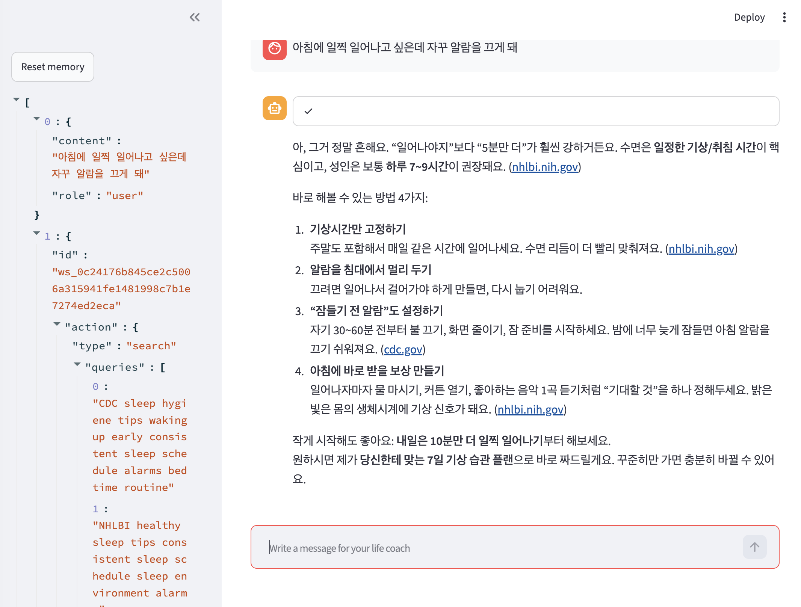
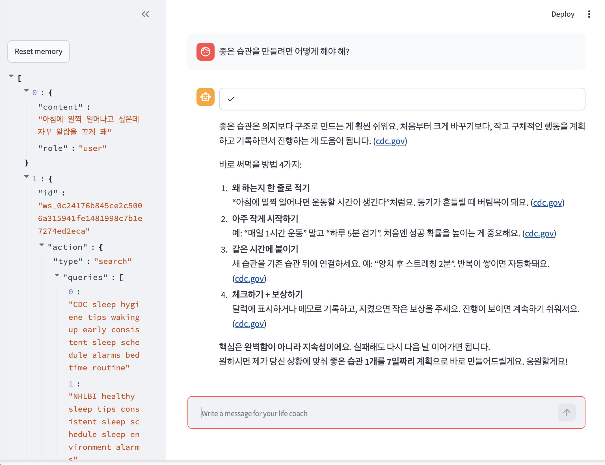

# Life Coach Agent (Streamlit + Web Search)

**OpenAI Agents SDK**(`Agent` + `Runner`)와 **Streamlit** 채팅 UI로 만든 라이프 코치 에이전트입니다. 사용자의 목표·고민을 듣고, 필요하면 **웹 검색 도구**로 검증된 최신 조언(동기부여·자기계발·습관 형성)을 찾아 격려하는 코치처럼 답변합니다. **세션 메모리**로 멀티턴 대화를 기억합니다.

## 과제 요구사항 대응

| 요구사항 | 구현 |
|---|---|
| Streamlit UI (`st.chat_input`, `st.chat_message`) | `main.py` — 채팅 입력·말풍선·진행 상태(`st.status`) |
| OpenAI Agents SDK (`Agent` + `Runner`) | `Agent(...)` 정의 + `Runner.run_streamed(...)` 스트리밍 실행 |
| 웹 검색 도구 | `WebSearchTool()` — 동기부여/자기계발/습관 조언 검색 |
| 세션 메모리 | `SQLiteSession` → `life-coach-memory.db` 로 대화 영속 저장 |
| 격려하는 라이프 코치 페르소나 | `Agent`의 `instructions` (공감 → 실천 팁 → 응원) |

## 동작 방식

1. `SQLiteSession`을 `st.session_state`에 보관해 리런·재실행 사이에도 대화 이력을 유지합니다.
2. 매 입력마다 `Runner.run_streamed(agent, message, session=session)`로 에이전트를 스트리밍 실행합니다.
3. 코치가 조언 검색이 필요하다고 판단하면 `WebSearchTool`을 호출하고, 그 결과를 바탕으로 답변을 생성합니다.
4. `raw_response_event`를 받아 웹 검색 진행 상태(🔍)와 답변 텍스트를 실시간으로 화면에 렌더링합니다.

```
사용자 입력 → Runner.run_streamed(agent, ..., session)
            → (필요 시) WebSearchTool 호출  🔍
            → 공감 한 문장 → 번호 매긴 실천 팁 → 응원 한 문장
            → SQLiteSession 에 자동 저장 (다음 턴에서 기억)
```

## 실행 결과

**1. 첫 질문 — 웹 검색 후 격려 답변**

"아침에 일찍 일어나고 싶은데 자꾸 알람을 끄게 돼"라는 질문에, 코치가 웹 검색(`nhlbi.nih.gov` 등 출처 인용)으로 근거를 찾아 공감 → 번호 매긴 실천 팁 → 응원 순으로 답변합니다. 왼쪽 사이드바에는 세션 메모리(웹 검색 쿼리 포함)가 그대로 쌓입니다.



**2. 후속 질문 — 멀티턴 기억 + 재검색**

"좋은 습관을 만들려면 어떻게 해야 해?" 후속 질문에서도 이전 대화를 기억한 채 다시 웹 검색(`cdc.gov` 인용)으로 habit stacking 등 검증된 방법을 안내합니다. 사이드바 메모리가 계속 누적되는 것을 확인할 수 있습니다.


