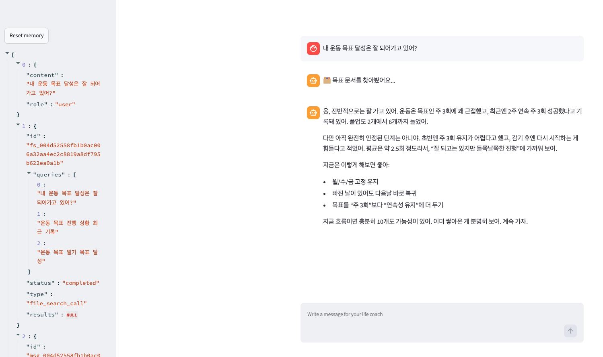

# Life Coach Agent

코치가 사용자의 **개인 목표·일기 문서(`goals.txt`)**를 기억하고, 거기에 적힌 목표·과거 기록을 근거로 진행 상황을 짚어줍니다. 필요하면 **웹 검색**까지 결합해 개인화된 조언을 합니다. 대화는 **세션 메모리**로 멀티턴 동안 유지됩니다.

## 과제 요구사항 대응

| 요구사항 | 구현 |
|---|---|
| 개인 목표가 담긴 문서(PDF/TXT) 작성 | `goals.txt` — 올해 목표(운동·독서·수면·영어) + 날짜별 일기 + 현재 상태 요약 |
| 에이전트에 파일 검색 도구 추가 | `FileSearchTool(vector_store_ids=[...])` — `goals.txt`를 올린 vector store 검색 |
| 업로드된 목표를 참조한 조언 | `instructions` — 먼저 목표 문서를 찾아 목표·기록을 근거로 답하도록 지시 |
| 웹 검색과 결합한 개인화 추천 | `WebSearchTool()` 병행 — 목표 확인 후 최신 팁을 검색해 함께 제안 |
| 세션 메모리 | `SQLiteSession` → `life-coach-memory.db` 로 대화 영속 저장 |

## 동작 방식

1. `goals.txt`를 OpenAI **vector store**에 올려두고, `FileSearchTool`로 그 저장소를 검색합니다.
2. 매 입력마다 `Runner.run_streamed(agent, message, session=session)`로 에이전트를 스트리밍 실행합니다.
3. 진행 상황·목표 관련 질문이면 코치가 먼저 **목표 문서**를 검색(🗂️)하고, 필요하면 **웹 검색**(🔍)으로 검증된 팁을 찾습니다.
4. `raw_response_event`를 받아 검색 진행 상태와 답변 텍스트를 실시간으로 렌더링합니다.

```
사용자 입력 → Runner.run_streamed(agent, ..., session)
            → FileSearchTool 로 goals.txt 검색  🗂️  (목표·최근 기록 확인)
            → (필요 시) WebSearchTool 호출       🔍  (최신 팁)
            → 공감 → 목표·기록 기반 실천 제안 → 응원
            → SQLiteSession 에 자동 저장 (다음 턴에서 기억)
```

## 실행 결과


